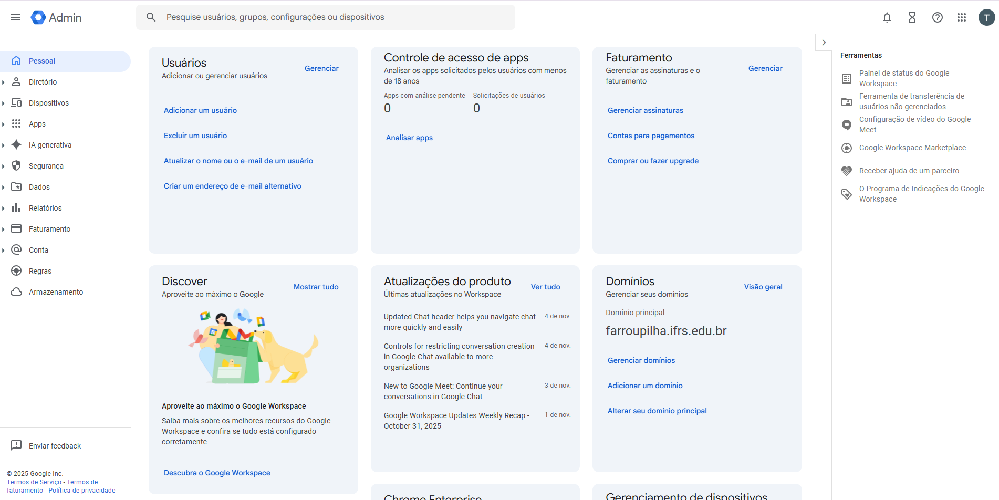

A senha de email e serviços Google são gerenciadas diretamente no Google, para isso devemos estar logados com nossa conta do setor de TI. Após estar logado, basta clicar no logotipo do seu usuário Google e escolher a opção *Admin Console*.

Entrando no *Admin Console* ele irá solicitar a senha novamente e abrirá o painel de cotrole:

**Depois de acessar o *Admin Console*, para alterarmos uma senha seguimos os seguintes passos:**

- Clique em **Gerenciar** no quadrado de Usuários
- Pesquise o nome de usuário no campo de busca que fica na área superior da página
- Ele mostrará todas as opções de usuário com o nome digitado. Identifique e clique no usuário que deseja alterar a senha.
- Na página sobre o usuário, basta clicar em redefinir senha. Ele dará a opção de criar senha aleatória ou da pessoa criar.
- Peça para a pessoa digitar (se ela estiver presencialmente), desmarque a opção de pedir para a pessoa alterar a senha ao fazer login. Caso a pessoa não esteja presencialmente, deixe marcada essa opção, crie uma senha e encaminhe para a mesma.
- Ao final, basta clicar em redefinir.
